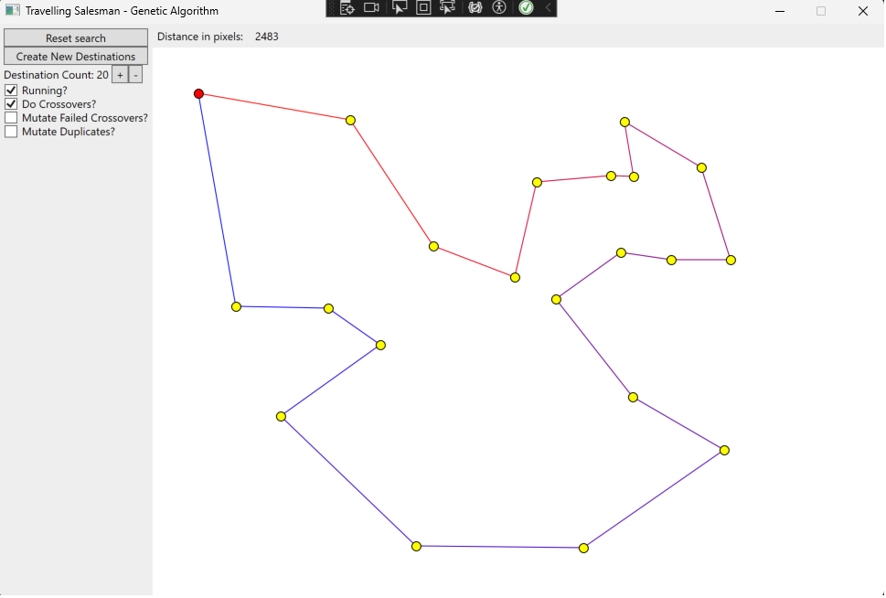

# Travelling Salesman – Genetic Algorithm

A C# implementation of the **Travelling Salesman Problem (TSP)** using a **Genetic Algorithm**.  
This project demonstrates how evolutionary computation techniques such as **mutation**, **crossover**, and **population-based search** can be applied to solve NP-hard optimization problems.

---

## Key Concepts

### Travelling Salesman Problem (TSP)
The Travelling Salesman Problem is a classic optimization problem:  
> Given a list of cities (locations) and their pairwise distances, find the shortest possible route that visits each city exactly once and returns to the starting point.  

The TSP is **NP-hard**, meaning no efficient algorithm is known to solve all cases optimally in polynomial time. Approximation and heuristic methods such as **Genetic Algorithms (GA)** are widely used to find near-optimal solutions.

### Genetic Algorithm Approach
This project applies the following GA concepts:
- **Population Initialization**: Randomly generates candidate routes (chromosomes).  
- **Fitness Evaluation**: Each route is evaluated by computing its total travel distance.  
- **Crossover (Recombination)**: Combines segments of two parent routes to produce new offspring.  
- **Mutation**: Randomly modifies routes (swap, move, or reverse cities) to maintain diversity.  
- **Selection and Survival**: Shorter routes are prioritized, keeping the best solutions across generations.  

---

## Features
- Configurable **population size**.  
- **Random route generation** with full shuffling.  
- **Multiple mutation operators**: swap, move, and reverse range.  
- **Crossover mechanism** with duplicate handling.  
- **Elitism**: best solution of each generation is preserved.  
- Duplicate detection and mutation to maintain genetic diversity.  
- Outputs the **shortest route found so far**.  

---

## Example GUI
  
*Example interface with GA and SA configuration options.*  

---

## Example Usage

**Initialization**:  
- Randomly generate a set of destinations (coordinates).  
- Create an initial population of routes.  

**Execution**:  
- Run multiple generations.  
- Apply crossover and mutation.  
- Preserve and evolve the shortest route.  

**Sample Output (conceptual):**
- Generation 0: Distance = 5372
- Generation 50: Distance = 2150
- Generation 100: Distance = 1789
- Best Solution Found: Distance = 1720
- Route: (0,0) → (120,340) → (250,100) → ... → (0,0)


---

## Prerequisites
- **.NET Framework / Visual Studio**  
- Basic understanding of:
  - Genetic Algorithms  
  - Optimization problems (TSP)  
  - C# programming  

---

## How to Run
1. Clone this repository:
   ```bash
   git clone https://github.com/your-username/TravellingSalesman-GA.git
2. Open the solution in Visual Studio.
3. Build and run the project.
4. Adjust parameters (number of destinations, population size, mutation rules) in code to experiment.

## Applications
- Demonstrating heuristic optimization methods.
- Educational tool for evolutionary computation.
- Basis for more advanced route optimization systems.
- Extensible to real-world logistics and scheduling problems.
